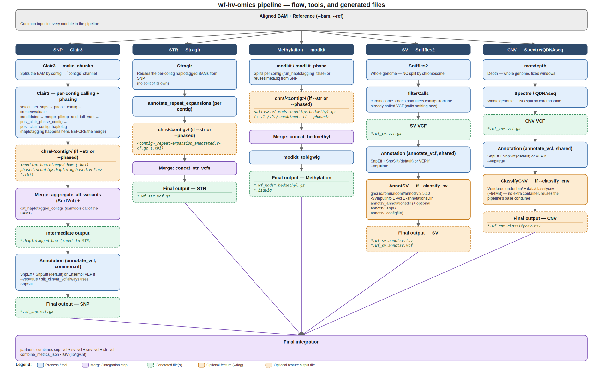

# OMICS (UNDER CONSTRUCTION)

PRE-ALFA

All-in-one workflow from base calling to ACMG/AMP classification and/or reports for Single-Nucleotide Variant (SNV), Structural Variant (SV), Copy Number Variation (CNV), Short Tandem Repeats (STR) and Differential Metilation (DMR).

## Introduction

The core of this workflow is based on https://github.com/epi2me-labs/wf-human-variation 

This repository contains a [nextflow](https://www.nextflow.io/) workflow for analysing variation in human genomic data. Specifically this workflow can perform the following:

* diploid variant calling
* structural variant calling
* analysis of modified base calls
* copy number variant calling
* short tandem repeat (STR) expansion genotyping
* ACMG/AMP classification of SNVs using AutoGVP or Araucaria
* ACMG/AMP classification of SVs using AnnotSV
* ACMG/AMP classification of CNVs using ClassifyCNV
* Differential Metilation with ont-methylDMR-kit
* Graphical Reports for SNVs using Araucaria
* Graphical Reports for SVs using KnotAnnotSV
* Graphical Reports for CNV
* Graphical Report for DMRs using Methylartist and Modtools

<figure>

<figcaption>Schematic depicting wf-human-variation workflow.</figcaption>
</figure>

The tools embedded in individual sub-workflows within wf-human-variation are specifically designed for use with whole-genome Oxford Nanopore Technologies sequencing data. While 20x average coverage is the absolute minimum requirement for the workflow to run, we recommend an average coverage above 30x to ensure optimal performance. Usage below the minimum coverage may cause the workflow to terminate with an error, or yield unexpected outcomes.

## Compute requirements

Recommended requirements:

+ CPUs = 32
+ Memory = 128GB

Minimum requirements:

+ CPUs = 16
+ Memory = 32GB

Approximate run time: Variable depending on whether it is targeted sequencing or whole genome sequencing, as well as coverage and the individual analyses requested. For instance, a 90X human sample run (options: `--snp --sv --mod --str --cnv --phased --sex XY`) takes less than 8h with recommended resources.

